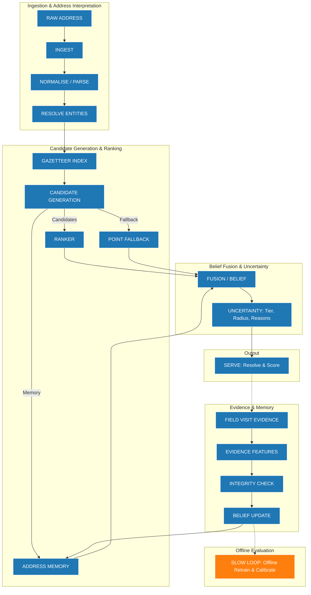

# SUTRA - Address Geocoder That Learns from Field Visits

SUTRA (**Semantic Utility for Traceable Resolution of Addresses**) treats address geocoding as an evidence-driven decision problem rather than a one-shot coordinate prediction. It resolves written addresses using a restricted official candidate family, returns a coordinate accompanied by spatial granularity and calibrated uncertainty, and utilizes trusted field evidence to continuously correct place beliefs over time.

 **[Open the SUTRA Web Application](https://sutra-geospatial-address-intelligence.vercel.app/)**

## B. Website Screenshots and Product Walkthrough

### Overview Dashboard

The high-level control panel tracking verification loads, current system throughput, and queue health.

### The Resolver

The main resolution interface. Here, the text is evaluated against memory and official gazetteer candidates. The system presents the optimal candidate with radius uncertainty, allowing operators to decide whether to *Serve* or *Request Verification*.

### Field Evidence

A transparent view of field visits as observed reality. Visits are weighted and tracked, confirming locations and updating beliefs without automatically overwriting earlier high-integrity truths.

### Verify Queue

The queue holding contested or poorly-scored addresses, enforcing human-in-the-loop review actions based on explicit evidence flags.

### Places

Place-level knowledge representing SUTRA's physical memory of a location, independent of account identifiers.

### Method / Trust

Traceability interface showing exactly why a coordinate was chosen, exposing the confidence tier and underlying provenance.

## C. Problem Definition

Address geocoding in this dataset poses unique challenges that invalidate simple coordinate-prediction approaches:
- **Coarse Source Coordinates:** Existing vendor coordinates exhibit a median error of 376.4 m. Predicting an exact `(x, y)` point blindly trusts an often inaccurate baseline.
- **Ambiguous Locality Information:** Addresses frequently contain outdated or misaligned pincodes that conflict with locality text, easily confusing raw text search.
- **Incomplete Candidate Coverage:** Official datasets often lack rooftop-level precision for rural or unmapped addresses.
- **Field Observation Contradictions:** Field visits routinely contradict baseline coordinates (e.g., negative outcomes recorded far from actual properties).
- **Coordinate Availability vs. Reliability:** The presence of a GPS pin does not guarantee accuracy. A 10 m pin from a failed delivery is useless for finding a property.

SUTRA ensures that every served coordinate is reliable by appending radius uncertainty and integrity reasons, explicitly separating **known truth** from **inferred guesses**.

## D. SUTRA Approach

SUTRA completely abandons black-box geographic predictions. The resolution path follows:
1. **Raw Address Text**
2. **Normalization and Parsing:** Typing specific elements (house no, locality).
3. **Entity Resolution:** Aligning tokens against official town and locality gazetteers.
4. **Candidate Generation:** Fetching restricted, official-only candidates (frozen vendor baselines, local boundaries, verified memory).
5. **Candidate Ranking:** A small learning-to-rank algorithm scores candidates based on text features, hierarchy, and spatial safety.
6. **Belief Fusion and Uncertainty:** Combining score and historical place memory, then wrapping it in a calibrated tier/radius.
7. **Actionable Outcomes:** Deciding whether to `SERVE` (safe), `VERIFY_FIRST` (uncertain), or `REFUSE` (unsafe/no candidate).

**When Field Visits Occur:**
1. **Field Observation:** Agent visits coordinate.
2. **Evidence Extraction:** GPS, dwell time, and reported outcome are logged.
3. **Integrity Weighting:** Outcomes are scored. A negative outcome (e.g., "address not traceable") lowers trust in the record but does *not* move the physical place coordinate.
4. **Belief Update & Place Memory:** Sustained evidence alters place memory safely.

## E. Master Architecture Workflow


*(Blue = Implemented Production, Orange = Offline Experiment/Analysis)*

## F. Technical Architecture and Stack
- **React & Vite Frontend (`battle_model/`):** An interactive UI deployed to Vercel that calls the backend. 
- **Python Intelligence Engine (`sutra/`):** Standard-library heavily optimized Python API layer containing candidate generation, ranking heuristics, memory retrieval, and logic.
- **SQLite Offline Store (`data/derived/runtime/`):** A fast, embedded relational database that safely stores persistent append-only audit histories and verified memory without an external network dependency.
- **Data & Coordinate Processing (`tools/`):** Tooling for EDA, offline leakage testing, spatial metric generation, and offline place blocking.
- **Offline Evaluation (`notebooks/`):** The fully separated Python environment (`.ipynb`) where feature engineering and model training evaluation occurs.

## G. Data and Governance
SUTRA relies exclusively on **Official PS3 Data** (`data/official_ps3/`).
- **Address Inputs:** `addresses.csv`
- **Candidate Geometry:** `towns.csv`, `localities.csv`, `landmarks_poi.csv`, `baseline_geocodes.csv`.
- **Field Observations:** `field_visits.csv` (evidence layer only).
- **Evaluation Only:** `surveyed_addresses.csv` (rigidly firewalled; hidden from candidate generation).

**Governance Constraint:** No external mapping APIs or downloaded third-party gazetteers are included. SUTRA learns entirely from its own restricted ecosystem.

## H. Deep EDA and Discoveries

1. **Baseline Precision Labels vs. Observed Spatial Error:** A pin categorized as "precise" by a vendor does not automatically mean "accurate". Vendors commonly place pins on nearby landmarks when failing to find rooftops.
2. **Account Identity vs. Place Identity:** Multiple accounts often physically reside in the exact same location. Treating address resolution as an account problem (1:1) causes redundancy. Place Memory clusters overlapping accounts.
3. **Negative Outcomes Are Not Spatial Ground Truths:** Agents reporting "Address not Traceable" after spending 1.3 minutes standing 1,600m from the true coordinate means negative evidence is only useful to flag record suspicion, not to relocate coordinates.
4. **Candidate Oracle Ceiling:** Relying entirely on existing official candidates gives a maximum possible oracle precision of ~76% within 500m. True resolution requires memory loops.

## I. Add beautiful EDA plots to the README

### Baseline Spatial Error

The empirical CDF of the vendor baseline against surveyed truth. The long tail demonstrates why relying on a vendor point without an uncertainty radius leads to catastrophic routing failures.

### Candidate Source Quality

Comparison of errors across different candidate generation arms (vendor baseline, towns, localities). Using multiple arms allows the ranker to safely fall back when specific arms produce unviable outliers.

### Candidate Ceiling

The theoretical maximum performance if a perfect ranker chose the optimal coordinate from the available official candidates, establishing the hard upper bound of SUTRA's cold-start performance.

### Cold Start vs. Evidence Regimes

Visualizing the dramatic shift in spatial error once field evidence is folded into Address Memory.

## J. Model Training and Evaluation
The `notebooks/SUTRA_Model_Training_FINAL.ipynb` file encapsulates the final offline evaluation and training workflow. 
We evaluated logistic regression, Pairwise ranking (LambdaMART-style), and a deterministic **RULE baseline**.
**Outcome:** The deterministic production RULE remains the production configuration. In S-VAL offline evaluation, the advanced learned challengers failed to clear the strict predefined promotion gate required to supersede the honest, interpretable RULE configuration.

## K. Final Measured Results
All figures derived explicitly from the final authoritative S-EVAL artifacts:

- **Cold-start S-EVAL (n=100):**
  - 71% within 500 m
  - Median error: 375.8 m
- **Independent S-EVAL product lane (n=100):**
  - <100m: 33%
  - <250m: 55%
  - <500m: 76%
  - Median error: 202.2 m
- **Warm/Evidence Evaluation (n=31 answered cases):**
  - 96.77% within 500 m
  - Median error: 12.4 m

*(Note: These distinct regimes are explicit and should not be conflated into a single monolithic "model accuracy" metric.)*

## L. Leakage Prevention and Evaluation Integrity
- **Surveyed-Truth Firewall:** `surveyed_addresses.csv` is explicitly denied access from the `sutra/` module.
- **S-TRAIN / S-VAL / S-EVAL Separation:** Offline folds strictly prevent target leakage.
- **As-of Temporal Filtering:** Features derived from field visits respect `as_of` constraints to ensure future visits never bleed into past resolutions.

## M. Field Evidence, Integrity and Memory
Field visits are integrated as evidence, not automatic overwrites. SUTRA uses:
- **Evidence Weights:** High dwell times and consistent trails boost integrity; single weak observations are down-weighted.
- **Contradiction State:** If a new visit severely conflicts with an established Place Memory, the memory enters a `CONTESTED` state instead of silently shifting.
- **Negative Evidence:** A failed visit widens the radius and marks the address `MOVED_SUSPECTED`, triggering re-verification queues.

## N. Failure Modes and Limitations
- **Ambiguous Address Text:** Deeply ambiguous text (e.g., generic street names shared across multiple towns) restricts resolution to coarse locality fallback tiers.
- **Official Candidate Limitations:** In cold-start scenarios, if the baseline vendor point is poor and no official locality polygon covers the area, the system cannot invent a closer point and must refuse service or serve a wide town centroid.
- **Warm/Evidence Coverage Gap:** The 12.4 m median error is achieved *only* on the subset of records with reliable prior field evidence, not globally.

## O. Repository Structure
- `battle_model/` - The Vite + React web frontend codebase.
- `sutra/` - The Python core engine, ranking APIs, memory indexing, and belief fusion layer.
- `data/` - Holds `official_ps3/` (firewalled) and `derived/` tables + SQLite memory databases.
- `tools/` - Diagnostics, evaluations, and fast pre-compilation tools.
- `notebooks/` - The final model-training and EDA Jupyter notebook.
- `screenshots/` - Curated visuals of the frontend.
- `docs/assets/eda/` - Rendered analytical plots supporting deep insights.

## P. Running Locally
Ensure Python 3.11+ and Node.js 18+ are installed.

**1. Start the Python Backend**
```bash
python3 tools/serve_runtime.py --port 8000
```
*(The backend expects port 8000. It reads `data/derived/runtime/` indexes directly.)*

**2. Start the Frontend**
```bash
cd battle_model
npm install
npm run dev
```

## Q. Reproducibility and Tests
All configurations and architectural contracts are mechanically verified by a suite of invariant checks.
```bash
# Run full suite (manifest validation -> data cleaning -> invariant checks)
bash tools/reproduce.sh

# Verify spatial leakage and file constraints
python3 tools/check_leakage.py
python3 tools/check_workspace.py
```

## R. Roadmap and Status
- **Implemented & Tested:** Base Candidate Generation, Ranker Rules, Memory Integrity, Backend APIs, React Frontend, Offline Leakage evaluations.
- **Offline Experiment / Analyzed:** LambdaMART challenger, Continuous Online Slow Loop retraining.
- **Not Implemented:** Advanced LLM parsers, RL visit allocations, External Map Matching (prohibited by data governance).
