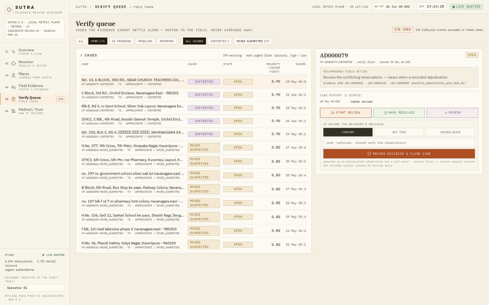
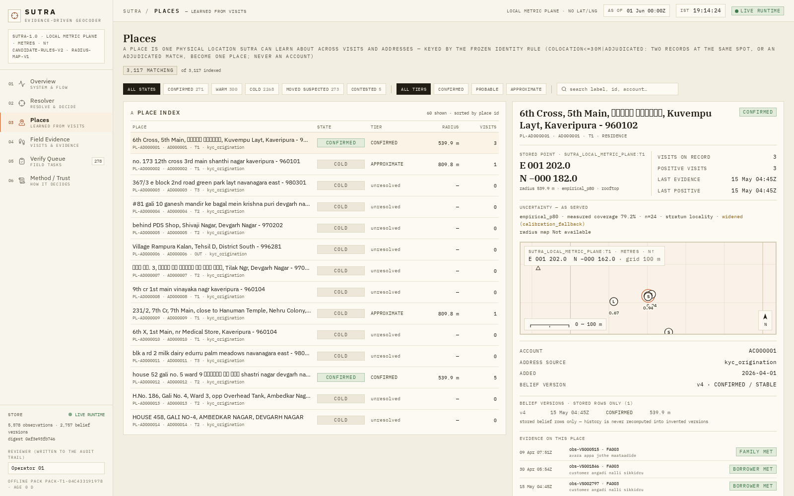
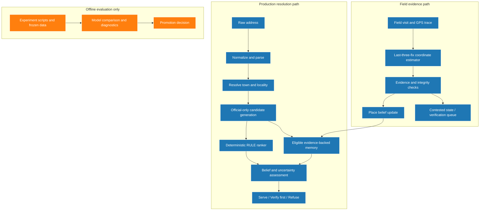
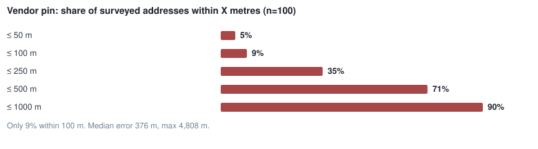
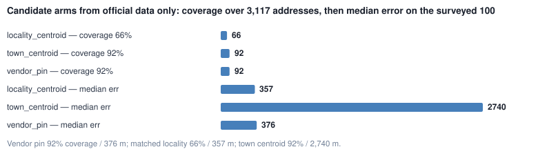
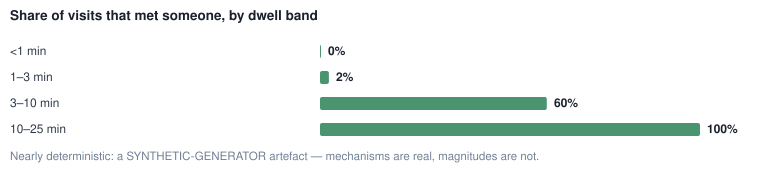
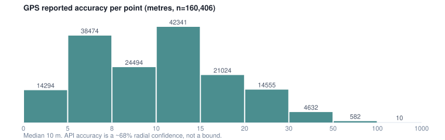

# SUTRA — Address Geocoder That Learns from Field Visits

**SUTRA (Semantic Utility for Traceable Resolution of Addresses)** treats address geocoding as an evidence-driven decision problem rather than a one-shot coordinate prediction. It resolves written addresses against a restricted official candidate family, returns a coordinate with spatial granularity and provenance-informed uncertainty, and uses trusted field evidence to update place beliefs over time.

**Live application:** [Open SUTRA](https://sutra-geospatial-address-intelligence.vercel.app/)

## 1. Product walkthrough

### Overview dashboard


Operational overview of verification load, system throughput, and queue health.

### Address resolver


The resolver compares an address against official candidates and eligible evidence-backed memory. The result includes a proposed coordinate, provenance, uncertainty information, and an action such as serving the result or requesting verification.

### Field evidence


Field visits are recorded as evidence. A visit can strengthen or contradict a belief; it does not automatically overwrite an established physical-place coordinate.

### Verification queue


Contested or insufficiently supported results can be routed for human review.

### Place memory


Place memory is organized around physical-place evidence rather than account identity.

### Method and trust


The method view exposes the reason, provenance, and uncertainty behind a resolution.

## 2. Problem definition

The supplied address dataset makes simple coordinate prediction unreliable:

- **Coarse source coordinates:** the existing vendor baseline has a median error of approximately **376.4 m** against surveyed truth.
- **Ambiguous locality information:** locality names and pincodes can conflict; stale pincodes can outweigh stronger address-text evidence in a naïve matcher.
- **Incomplete candidate coverage:** official candidate sources do not always contain a rooftop-level point for a rural or unmapped address.
- **Contradictory field outcomes:** an `address_not_traceable` visit has a median dwell of about **1.3 minutes** and lies a median **1,603 m** from surveyed truth in the analysed sample. A failed visit is not necessarily at the property.
- **A GPS pin is not a guarantee:** a coordinate can look precise while representing the wrong place.

SUTRA therefore separates **observed evidence** from **inference**. It can serve a supported result, request verification, or refuse an unsupported resolution instead of presenting every coordinate as ground truth.

## 3. Resolution and field-evidence workflow

### Address resolution

1. **Ingest and normalize** the written address.
2. **Resolve address entities** against the official town and locality data.
3. **Generate candidates** from the restricted official candidate family, including the frozen vendor baseline, official geographic candidates, and eligible evidence-backed memory.
4. **Rank candidates** with the deterministic production **RULE-based ranker**.
5. **Fuse evidence and assess uncertainty**, using candidate provenance and eligible field evidence to determine the uncertainty tier/radius and available resolution action.
6. **Return an outcome:** `SERVE`, `VERIFY_FIRST`, or `REFUSE`, according to the implementation's safety and eligibility rules.

Learned rankers were evaluated offline but were not promoted to the production request path.

### Field observations and place memory

1. A field visit contributes GPS trace points, dwell time, and a reported outcome.
2. For a visit with an available GPS track, the coordinate estimator uses the component-wise median of the **last three track fixes**; the raw check-in is retained as provenance and used as a fallback when a track is unavailable.
3. Evidence is integrity-weighted. Repeated, consistent observations can support a place belief; contradictory observations can mark it `CONTESTED` and trigger review.
4. A negative outcome can lower trust, widen uncertainty, or request verification. **Negative evidence does not relocate the physical place coordinate.**
5. Memory may be emitted as evidence-backed memory only when its prior coordinate derives from field observations, not when it merely re-wraps a static vendor or other candidate coordinate.

## 4. Architecture



The diagram separates the production request/evidence flow from offline experiments. Offline model fitting and model-selection experiments are not continuous online retraining and do not place a learned model in the production request path.

## 5. Technical architecture and data governance

- **Frontend — `battle_model/`:** React and Vite application deployed through Vercel.
- **Resolution engine — `sutra/`:** address normalization, candidate generation, deterministic ranking, evidence handling, memory, belief fusion, uncertainty, and API logic.
- **Runtime store — `data/derived/runtime/`:** local SQLite-backed persistence for runtime records and place-memory state; no external database service is required.
- **Offline tooling — `tools/`:** data checks, candidate generation, evidence diagnostics, experiment runs, place-block evaluation, and reproducibility checks.
- **Experiment artifacts — `data/derived/`:** frozen configurations, reports, result tables, and derived analytical charts.

### Data boundary

SUTRA uses the official PS3 dataset and the relevant shared tables only. It does not add external map services, third-party geocoders, downloaded gazetteers, scraped POIs, or external address databases to the product-data workflow.

- **Address inputs:** `addresses.csv`
- **Official candidate sources:** `towns.csv`, `localities.csv`, `landmarks_poi.csv`, and `baseline_geocodes.csv`
- **Field evidence:** `field_visits.csv` and the official GPS trace data, used as evidence rather than surveyed truth
- **Evaluation-only labels:** `surveyed_addresses.csv`, kept out of candidate generation and production resolution

The coordinates in this dataset are **local metric `(x, y)` values in metres**, not latitude/longitude. SUTRA does not invent road geometry or convert these coordinates into latitude/longitude claims.

## 6. Research findings and design decisions

### 6.1 Vendor pins and failed visits

The vendor baseline's median spatial error is about **376.4 m**. In the analysed failed-visit sample, `address_not_traceable` outcomes had approximately **1.3 minutes** of dwell and a median distance of **1,603 m** from surveyed truth. The vendor pin was nearer to surveyed truth than the failed-visit location in **84.9%** of those cases.

**Design decision:** treat a failed visit as negative or contradictory evidence, not as a new property coordinate. Lower confidence or request re-verification; do not relocate the place from a failed visit alone.

### 6.2 Locality retrieval and ranking are different problems

The earlier locality matcher could accept a shared token and let a stale pincode outweigh the locality text. It selected the wrong locality on **118 of 292 supervision-pool rows**. Retrieval-v2 requires stronger locality-name coverage, gives priority to the rarest locality token, uses deterministic tie-breaking, and avoids silently selecting one locality when a pincode maps to multiple localities.

| Measure on the 292-row supervision pool | Retrieval-v1 | Retrieval-v2 |
|---|---:|---:|
| Median error of locality candidate | 811.9 m | 319.6 m |
| Candidate oracle within 500 m | 87.67% | 91.44% |
| Candidate-oracle median error | 214.1 m | 196.1 m |
| Actual ranked top-1 within 500 m | 83.9% | 83.9% |

The candidate oracle asks what the best available candidate could achieve if selected using ground truth for evaluation. It is **not** an executable ranking algorithm or a production metric. Retrieval-v2 improved the candidate set, but top-1 ranking on this pool remained unchanged: candidate generation and candidate selection are separate problems.

On the locked **S-EVAL** set (n=100), the documented static-candidate oracle is approximately **88% within 500 m**. That is an upper-bound reference for the available candidate family, not SUTRA's actual product-policy score.

### 6.3 Account identity is not physical-place identity

In the analysed data, **191 addresses** formed **81 co-location clusters** across different accounts (**127 pairs**). Conversely, addresses associated with the same account were a median **3,011.6 m** apart.

**Design decision:** key place memory using physical-place evidence and the co-location rule, not account identity. Account IDs and commercial attributes are not reliable substitutes for spatial evidence.

### 6.4 Preventing vendor pins from masquerading as memory

The memory audit found that **7 of 10** pool rows with errors above 500 m under the earlier warm policy were cases where the memory arm had simply re-wrapped the vendor pin and presented it as memory. In a separate temporal diagnostic, materializing an on-demand prior without the evidence-derived memory emission rule reduced the under-100 m rate from **89.03% to 64.98%**.

The final policy emits memory only when its prior coordinate is derived from accumulated field evidence. This is a **memory-integrity defect removal**, not a claim of a broad S-EVAL accuracy lift. On S-EVAL, the warm/evidence-only lane narrowed from 45 to 31 answered cases; the full 100-address product-policy result remained unchanged because withheld pin-derived memory claims fall back to the vendor answer with its own uncertainty and verification semantics.

### 6.5 Repeated GPS trace fixes improve visit-coordinate estimation

On a non-circular temporal holdout with **233 visits**, the median error of the ingested visit coordinate fell from **28.7 m** using the single check-in sample to **7.6 m** using the median of the last three GPS trace fixes. The under-100 m rate increased from **76.39% to 86.27%**.

This is a **visit-coordinate estimation** result: a trace gives a better estimate of where a visit occurred. It is not the cold-start address-resolution accuracy and should not be reported as such.

### 6.6 Negative experiments matter

Two candidate generators were tested and rejected because they harmed more cases than they rescued:

| Candidate generator | Coverage | Median error | Frozen misses rescued | Rows made worse |
|---|---:|---:|---:|---:|
| Address-book near-duplicate | 42.81% | 247.0 m | 1 | 66 |
| Pincode-consistent locality | 85.27% | 321.9 m | 0 | 144 |

The findings support a constrained candidate family rather than adding more candidate sources without demonstrated net benefit.

## 7. Exploratory data analysis charts

### Vendor baseline error


The long error tail motivates exposing uncertainty instead of treating the vendor coordinate as exact.

### Candidate source comparison


Candidate quality differs by source. A larger set is useful only when the candidate is relevant and the ranker can select it appropriately.

### Dwell time and visit outcome


Dwell time helps interpret evidence quality; it does not turn a failed visit into a property coordinate.

### GPS accuracy


GPS quality and trace aggregation inform coordinate estimation, separately from address-text resolution.

## 8. Offline model evaluation and selection

The production system uses the deterministic **RULE** ranker. Logistic Regression, LambdaMART, and Pairwise challengers were evaluated offline on S-VAL (**n=69**) against the predefined promotion gate.

| Ranker | S-VAL within 500 m | S-VAL median error | Decision |
|---|---:|---:|---|
| RULE (production) | 84.06% | 248.9 m | Retained |
| Logistic Regression | 82.61% | 224.7 m | Not promoted; paired result not resolved by this dataset |
| LambdaMART | 84.06% | 248.9 m | Not promoted; identical top-1 result series |
| Pairwise | 59.42% | 397.1 m | Rejected; RULE performed better |

The learned challengers did not clear the promotion gate. Offline fit results are not deployed model performance. The reproducible experiment scripts, reports, and receipts live in `tools/` and `data/derived/`; no learned model artifact is required by the production request path.

Useful experiment references:

- [`precision_optimization_report.md`](data/derived/precision_optimization_report.md)
- [`experiment_d_report.md`](data/derived/experiment_d_report.md)
- [`final_precision_config.json`](data/derived/final_precision_config.json)
- [`evidence_memory_policy_report.md`](data/derived/evidence_memory_policy_report.md)
- [`SUTRA_Model_Training_FINAL.ipynb`](notebooks/SUTRA_Model_Training_FINAL.ipynb)

## 9. Final measured results

These figures refer to different populations and must not be conflated.

| Evaluation regime | n | Within 100 m | Within 250 m | Within 500 m | Median error |
|---|---:|---:|---:|---:|---:|
| Cold-start S-EVAL, static candidates | 100 | 9% | 35% | 71% | 375.8 m |
| Product-policy evaluation on S-EVAL | 100 | 33% | 55% | 76% | 202.2 m |
| Warm/evidence-only S-EVAL answers | 31 | 83.87% | 93.55% | 96.77% | 12.4 m |
| Non-circular temporal product proxy, T0 = 2026-05-15 | 229 | 85.15% | 93.01% | 98.69% | 7.9 m |
| Candidate oracle on locked S-EVAL, reference only | 100 | — | — | ~88% | Not used as the product median |

**How to read this table:**

- The **product-policy S-EVAL** row measures the actual policy over all 100 S-EVAL addresses. It is not a separate or independent population from cold-start S-EVAL.
- The **warm/evidence-only** row covers only 31 addresses for which the final policy had eligible field-evidence-backed memory at the cut. It is not representative of the whole address book and is not the result for all 100 product queries.
- The **temporal proxy** builds candidates from evidence strictly before T0 and evaluates them against promoted field evidence at or after T0. It is a non-circular future-evidence check, **not independently surveyed ground truth**.
- The **candidate oracle** uses evaluation truth to identify the best available candidate. It describes candidate availability, not actual top-1 production performance.

## 10. Leakage prevention and evaluation integrity

- **Surveyed-truth firewall:** `surveyed_addresses.csv` is reserved for offline evaluation and is not an input to production candidate generation.
- **Spatial leakage:** under the audited random-split setup, **36%** of held-out addresses with a met visit had a training met visit within **30 m**, and **81%** had one within **100 m**. Nearby addresses can share physical evidence even when their account IDs differ.
- **Place-block evaluation:** evaluation uses physical-place blocking so nearby addresses do not automatically cross the training/evaluation boundary.
- **As-of filtering:** evidence features are restricted to observations available at the query's `as_of` time. Future visits must not leak into a historical resolution.
- **Frozen evaluation populations:** S-TRAIN, S-VAL, and locked S-EVAL are distinguished; do not mix their metrics into one score.

## 11. Failure modes and limitations

- **Cold-start candidate ceiling:** if the vendor pin is poor and the official candidate set lacks a suitable locality or point, ranking alone cannot create a missing location. The locked S-EVAL oracle is about 88% within 500 m, so the current official candidate family does not support a claim of over 90% cold-start accuracy on that split.
- **Ambiguous address text:** deeply ambiguous text can leave only a coarse locality or town-level fallback, with a correspondingly broad uncertainty tier/radius.
- **Sparse ground truth:** S-EVAL contains 100 surveyed addresses. Its score should not be assumed to represent every address archetype in the full address book.
- **Limited warm coverage:** the 12.4 m median applies only to the 31 eligible warm/evidence answers, not all addresses.
- **No automatic relocation from a failed visit:** negative evidence can widen uncertainty, flag a suspected move, or request verification; it does not by itself move a physical-place coordinate.
- **No online model retraining:** the model-selection workflow is offline. Continuous retraining, advanced LLM parsing, RL-based visit allocation, and external map matching are not implemented; external geodata is outside the data-governance boundary.

## 12. Repository structure

```text
PS3_SUTRA/
├── battle_model/                  # React + Vite frontend
├── sutra/                         # Python resolution, ranking, memory and evidence engine
├── data/
│   ├── official_ps3/              # restricted official input data
│   └── derived/                    # runtime state, experiment results, receipts and EDA charts
├── tools/                         # reproduction, evaluation, diagnostics and validation scripts
├── notebooks/                     # Model training and EDA
├── screenshots/                   # product screenshots used above
└── README.md
```

## 13. Run locally

Prerequisites: Python 3.11+ and Node.js 18+.

### Start the Python backend

From the project root:

```bash
python3 tools/serve_runtime.py --port 8000
```

The runtime reads the derived indexes/store under `data/derived/runtime/`.

### Start the frontend

In another terminal:

```bash
cd battle_model
npm install
npm run dev
```

Use the development URL printed by Vite. Keep the backend running in the first terminal.

## 14. Reproducibility and checks

Run the repository's documented checks from the project root:

```bash
bash tools/reproduce.sh
python3 tools/check_leakage.py
python3 tools/check_workspace.py
```

`tools/reproduce.sh` runs the project's reproducibility pipeline. The separate leakage and workspace checks validate spatial/data-boundary constraints. Report a check as passing only after it has actually been run in the target environment.

## 15. Implementation status

**Implemented in the product:** official-only candidate generation, deterministic RULE ranking, belief and uncertainty handling, place memory, evidence integrity checks, backend APIs, frontend workflows, and verification paths.

**Evaluated offline:** retrieval-v1/v2 comparisons, candidate-generator alternatives, Logistic Regression/LambdaMART/Pairwise challengers, temporal holdouts, GPS trace estimation, and memory-policy diagnostics.

**Not implemented:** continuous online retraining, advanced LLM address parsing, RL-based field-visit allocation, and external map matching or external geographic-data ingestion.
