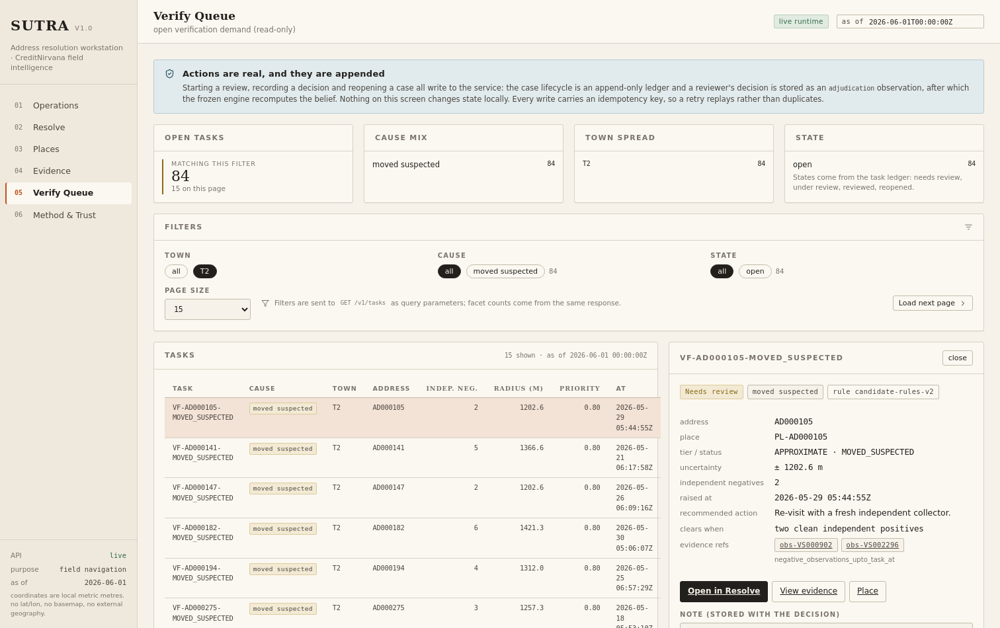
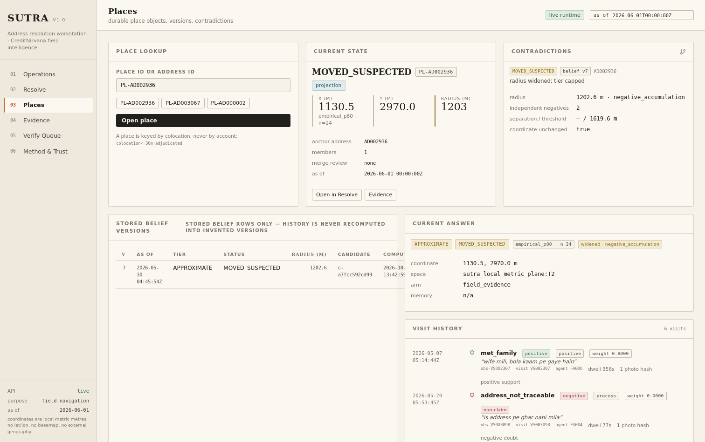
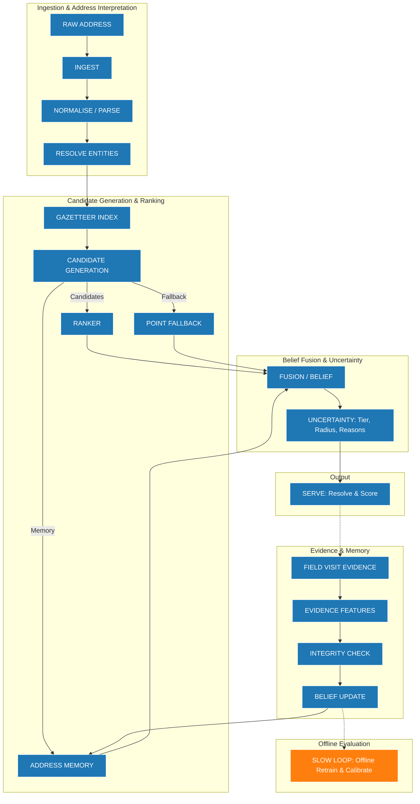
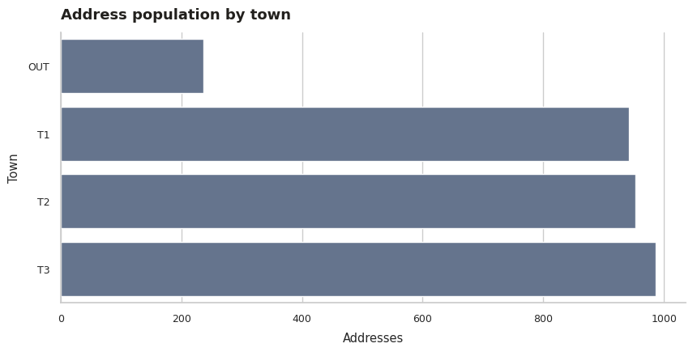
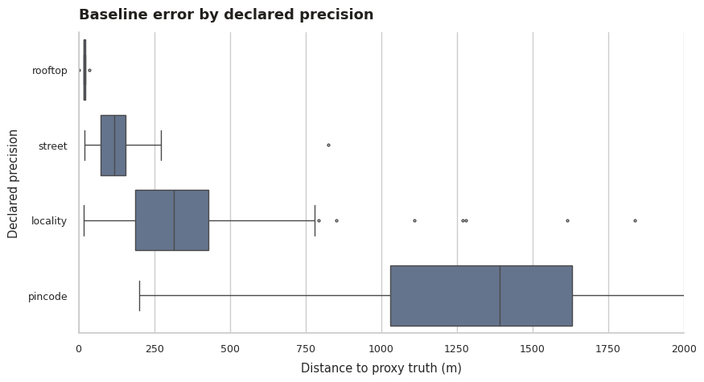
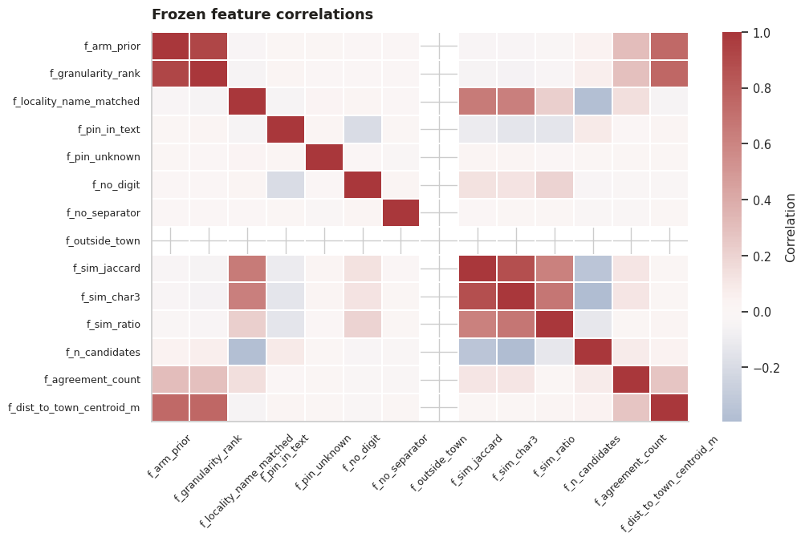
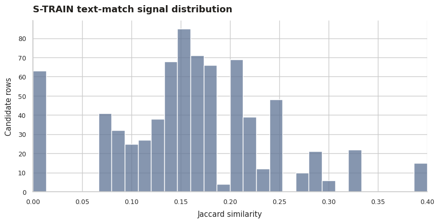

# SUTRA — Address Geocoder That Learns from Field Visits

SUTRA (**Semantic Utility for Traceable Resolution of Addresses**) treats address geocoding as an evidence-driven decision problem rather than a one-shot coordinate prediction. It resolves written addresses using a restricted official candidate family, returns a coordinate accompanied by spatial granularity and provenance-informed uncertainty, and utilizes trusted field evidence to continuously correct place beliefs over time.

👉 **[Open the SUTRA Web Application](https://sutra-geospatial-address-intelligence.vercel.app/)**

## B. Website Screenshots and Product Walkthrough

### Overview Dashboard

The high-level control panel tracking verification loads, current system throughput, and queue health.

### The Resolver

The main resolution interface. Here, the text is evaluated against memory and official gazetteer candidates. The system presents the optimal candidate with radius uncertainty, allowing operators to decide whether to *Serve* or *Request Verification*.

### Field Evidence

A transparent view of field visits as observed reality. Visits are weighted and tracked, confirming locations and updating beliefs without automatically overwriting earlier high-integrity truths.

### Verify Queue

The queue holding contested or poorly-scored addresses, enforcing human-in-the-loop review actions based on explicit evidence flags.

### Places

Place-level knowledge representing SUTRA's physical memory of a location, independent of account identifiers.

### Method / Trust

Traceability interface showing exactly why a coordinate was chosen, exposing the confidence tier and underlying provenance.

## C. Problem Definition

Address geocoding in this dataset poses unique challenges that invalidate simple coordinate-prediction approaches:
- **Coarse Source Coordinates:** Existing vendor coordinates exhibit a median error of 376.4 m. Predicting an exact `(x, y)` point blindly trusts an often inaccurate baseline.
- **Ambiguous Locality Information:** Addresses frequently contain outdated or misaligned pincodes that conflict with locality text, easily confusing raw text search.
- **Incomplete Candidate Coverage:** Official datasets often lack rooftop-level precision for rural or unmapped addresses.
- **Field Observation Contradictions:** Field visits routinely contradict baseline coordinates. A "not traceable" outcome typically occurs 1,603 m away from the true coordinate.
- **Coordinate Availability vs. Reliability:** The presence of a GPS pin does not guarantee accuracy. A 10 m pin from a failed delivery is useless for finding a property.

SUTRA replaces absolute claims of "correct" coordinates with precise declarations of uncertainty, provenance, verification status, and refusal. It explicitly separates **known truth** from **inferred guesses**.

## D. SUTRA Approach

SUTRA abandons black-box geographic predictions. The resolution path follows:
1. **Raw Address Text**
2. **Normalization and Parsing:** Typing specific elements (house no, locality).
3. **Entity Resolution:** Aligning tokens against official town and locality gazetteers.
4. **Candidate Generation:** Fetching restricted, official-only candidates (frozen vendor baselines, local boundaries, verified memory).
5. **Candidate Ranking:** A deterministic RULE-based ranker scores candidates based on spatial safety, evidence thresholds, and text hierarchy. (Learned challengers like LambdaMART were evaluated but failed to clear the offline promotion gate).
6. **Belief Fusion and Uncertainty:** Combining score and historical place memory, then wrapping it in uncertainty tiers and radii informed by candidate provenance and available field evidence.
7. **Actionable Outcomes:** Deciding whether to `SERVE` (safe), `VERIFY_FIRST` (uncertain), or `REFUSE` (unsafe/no candidate).

**When Field Visits Occur:**
1. **Field Observation:** Agent visits coordinate.
2. **Evidence Extraction:** GPS, dwell time, and reported outcome are logged.
3. **Integrity Weighting:** Outcomes are scored. A negative outcome (e.g., "address not traceable") lowers trust in the record but does *not* move the physical place coordinate.
4. **Belief Update & Place Memory:** Sustained evidence alters place memory safely.

## E. Master Architecture Workflow


*(Blue = Implemented Production, Orange = Offline Experiment/Analysis, Dashed = Unimplemented Capabilities)*

## F. Technical Architecture and Stack
- **React & Vite Frontend (`battle_model/`):** An interactive UI deployed to Vercel that calls the backend. 
- **Python Intelligence Engine (`sutra/`):** Standard-library heavily optimized Python API layer containing candidate generation, ranking heuristics, memory retrieval, and logic.
- **SQLite Offline Store (`data/derived/runtime/`):** A fast, embedded relational database that safely stores persistent append-only audit histories and verified memory without an external network dependency.
- **Data & Coordinate Processing (`tools/`):** Tooling for EDA, offline leakage testing, spatial metric generation, and offline place blocking.
- **Offline Evaluation (`notebooks/`):** The fully separated Python environment (`.ipynb`) where feature engineering and model training evaluation occurs.

## G. Data and Governance
SUTRA relies exclusively on **Official PS3 Data** (`data/official_ps3/`).
- **Address Inputs:** `addresses.csv`
- **Candidate Geometry:** `towns.csv`, `localities.csv`, `landmarks_poi.csv`, `baseline_geocodes.csv`.
- **Field Observations:** `field_visits.csv` (evidence layer only).
- **Evaluation Only:** `surveyed_addresses.csv` (rigidly firewalled; hidden from candidate generation).

**Governance Constraint:** No external mapping APIs or downloaded third-party gazetteers are included. SUTRA learns entirely from its own restricted ecosystem.

## H. Deep EDA and Discoveries

1. **Baseline Precision vs Actual Spatial Error:** 
   *Finding:* Vendor coordinates labeled "precise" can be drastically inaccurate. 
   *Evidence:* The vendor baseline has a median error of 376.4 m. Furthermore, failed agent check-ins ("not traceable") have a dwell time of 1.3 minutes but are located a median 1,603 m away from surveyed truth.
   *Consequence:* Relying blindly on vendor points without uncertainty radii leads to catastrophic failure.

2. **Locality-Matching Defect, Candidate Generation vs Ranking:** 
   *Finding:* Previous locality matching allowed shared tokens to accept stale pincodes, assigning the wrong locality in 118 of 292 pool rows. Improving the candidate pool does not automatically mean the ranker will select the right one.
   *Evidence:* Evaluated on the 292-row pool, the `retrieval-v2` update improved the candidate oracle ceiling from 88.01% to 91.44% (within 500 m) and reduced the oracle median error from 214.1 m to 196.1 m. However, the top-1 product ranking remained virtually unchanged (83.9%). 
   *Consequence:* Candidate generation and ranking are separate, orthogonal problems.

3. **Account Identity vs Physical-Place Identity & Co-location:** 
   *Finding:* Multiple accounts often reside at the exact same physical location. 
   *Evidence:* 191 addresses fell into 81 co-location clusters across entirely different accounts (127 pairs). Conversely, addresses belonging to the *same* account were a median 3,011.6 m apart. 
   *Consequence:* SUTRA's memory must be keyed by place evidence (co-location ≤ 30 m), never by account identity.

4. **Pin-Derived Memory Failure:** 
   *Finding:* Using a vendor pin as "memory" is actively harmful. 
   *Evidence:* Materializing a memory candidate from a mere vendor pin dropped temporal accuracy (< 100 m) from 0.8903 down to 0.6498. 
   *Consequence:* The final evidence-backed memory policy (P1b) strictly withholds pin-derived answers, safely narrowing the S-EVAL warm lane to 31 verified field-evidence cases rather than incorrectly emitting 45.

5. **GPS Trace Estimation vs Single Check-in:** 
   *Finding:* A visit's GPS track is a far better location estimator than its single check-in sample. 
   *Evidence:* Evaluated non-circularly on a temporal proxy population, aggregating the final three GPS trace fixes instead of a single check-in improved < 100 m accuracy from 0.7296 to 0.8240, reducing median error from 54.9 m to 22.7 m. 
   *Consequence:* This became the production coordinate policy, demonstrating that GPS trace extraction is vital for coordinate estimation, distinct from cold-start address resolution accuracy.

6. **Landmark Limitations and Negative Findings:** 
   *Finding:* Broadening candidate arms via generic landmarks creates excessive noise. 
   *Evidence:* An address-book near-duplicate generator (coverage 42.8%, median 247 m) rescued 1 location but ruined 66. A pincode-consistent locality generator (coverage 85%, median 321.9 m) rescued 0 locations and ruined 144.
   *Consequence:* These generators were formally rejected. SUTRA restricts itself to high-quality arms.

## I. EDA Plots

### Baseline Spatial Error

The empirical CDF of the vendor baseline against surveyed truth. The long tail demonstrates why relying on a vendor point without an uncertainty radius leads to catastrophic routing failures.

### Candidate Source Quality

Comparison of errors across different candidate generation arms (vendor baseline, towns, localities). Using multiple arms allows the ranker to safely fall back when specific arms produce unviable outliers.

### Candidate Ceiling

The theoretical maximum performance if a perfect ranker chose the optimal coordinate from the available official candidates, establishing the hard upper bound of SUTRA's cold-start performance.

### Cold Start vs. Evidence Regimes

Visualizing the dramatic shift in spatial error once field evidence is folded into Address Memory.

## J. Model Training and Evaluation
The `notebooks/SUTRA_Model_Training_FINAL.ipynb` file encapsulates the final offline evaluation and training workflow. 

**Model Selection:** The production system utilizes a deterministic **RULE-based ranker**. While advanced learned challengers (Logistic Regression, LambdaMART, and Pairwise ranking) were evaluated strictly offline on the S-VAL split, they failed to clear the predefined promotion gate required to supersede the honest, interpretable RULE configuration. Therefore, the challengers remain offline experiments.

## K. Final Measured Results
All figures derived explicitly from the final authoritative S-EVAL artifacts:

- **Cold-start S-EVAL (n=100):**
  - 71% within 500 m
  - Median error: 375.8 m
- **Independent S-EVAL product lane (n=100):**
  - < 100 m: 33%
  - < 250 m: 55%
  - < 500 m: 76%
  - Median error: 202.2 m
- **Warm/Evidence Evaluation (n=31 answered cases):**
  - 96.77% within 500 m
  - Median error: 12.4 m
- **Documented S-EVAL Candidate Oracle Ceiling (n=100):**
  - ~88.01% within 500 m
  - *(Note: The oracle ceiling represents candidate availability, not SUTRA's ranked performance, which is 76%).*

## L. Leakage Prevention and Evaluation Integrity
- **Surveyed-Truth Firewall:** `surveyed_addresses.csv` is explicitly denied access from the `sutra/` module.
- **Place-block Folds:** Random splits allow severe spatial leakage (test addresses with a met visit have a train met visit within 30 m in 36% of cases). The offline evaluation employs a place-block firewall (3007 blocks, 81 multi-address) to ensure out-of-fold generalization.
- **As-of Temporal Filtering:** Features derived from field visits respect `as_of` constraints to ensure future visits never bleed into past resolutions.

## M. Field Evidence, Integrity and Memory
Field visits are integrated as evidence, not automatic overwrites. SUTRA uses:
- **Evidence Weights:** High dwell times and consistent trails boost integrity; single weak observations are down-weighted.
- **Contradiction State:** If a new visit severely conflicts with an established Place Memory, the memory enters a `CONTESTED` state instead of silently shifting.
- **Negative Evidence:** A failed visit widens the radius and marks the address `MOVED_SUSPECTED`, triggering re-verification queues.

## N. Failure Modes and Limitations
- **Ambiguous Address Text:** Deeply ambiguous text restricts resolution to coarse locality fallback tiers.
- **Official Candidate Limitations:** In cold-start scenarios, if the baseline vendor point is poor and no official locality polygon covers the area, the system must refuse service or serve a wide town centroid. It cannot magically invent a closer point.
- **Warm/Evidence Coverage Gap:** The 12.4 m median error is achieved *only* on the verified 31/100 cases with reliable prior field evidence, not globally across the entire database.

## O. Repository Structure
- `battle_model/` - The Vite + React web frontend codebase.
- `sutra/` - The Python core engine, ranking APIs, memory indexing, and belief fusion layer.
- `data/` - Holds `official_ps3/` (firewalled) and `derived/` tables + SQLite memory databases.
- `tools/` - Diagnostics, evaluations, and fast pre-compilation tools.
- `notebooks/` - The final model-training and EDA Jupyter notebook.
- `screenshots/` - Curated visuals of the frontend.
- `docs/assets/eda/` - Rendered analytical plots supporting deep insights.

## P. Running Locally
Ensure Python 3.11+ and Node.js 18+ are installed.

**1. Start the Python Backend**
```bash
python3 tools/serve_runtime.py --port 8000
```
*(The backend expects port 8000. It reads `data/derived/runtime/` indexes directly.)*

**2. Start the Frontend**
```bash
cd battle_model
npm install
npm run dev
```

## Q. Reproducibility and Tests
All configurations and architectural contracts can be mechanically verified by a suite of invariant checks. (Note: `check_workspace.py` requires UTF-8 encoding configuration to read audit logs natively on Windows).
```bash
# Run full suite (manifest validation -> data cleaning -> invariant checks)
bash tools/reproduce.sh

# Verify spatial leakage and file constraints
python3 tools/check_leakage.py
python3 tools/check_workspace.py
```

## R. Roadmap and Status
- **Implemented & Tested:** Base Candidate Generation, Ranker Rules, Memory Integrity, Backend APIs, React Frontend, Offline Leakage evaluations.
- **Offline Experiment / Analyzed:** LambdaMART challenger, Continuous Offline Slow Loop retraining.
- **Not Implemented:** Advanced LLM parsers, RL visit allocations, External Map Matching (prohibited by data governance).
