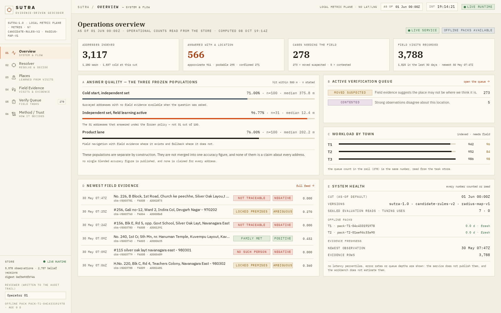
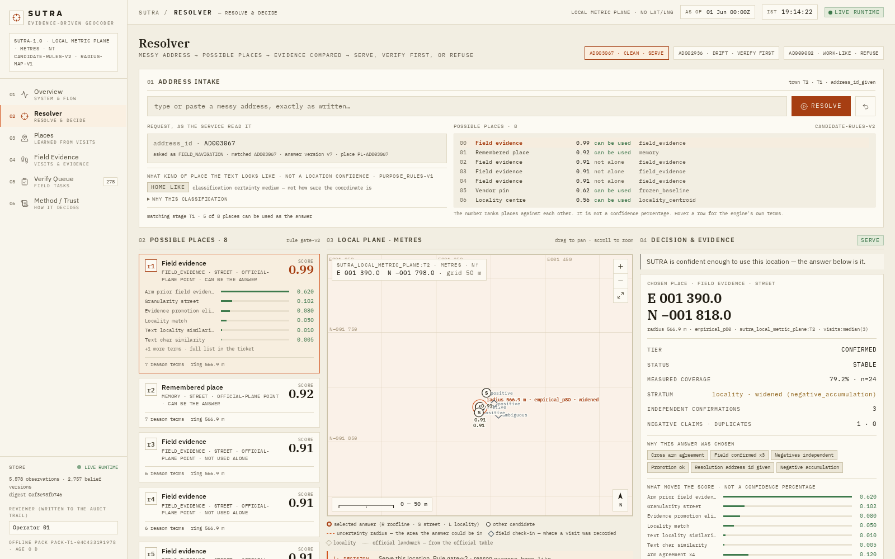
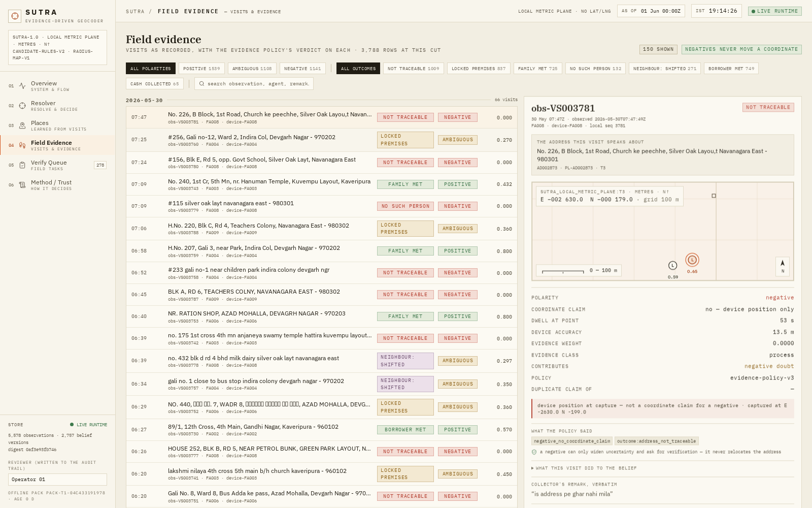
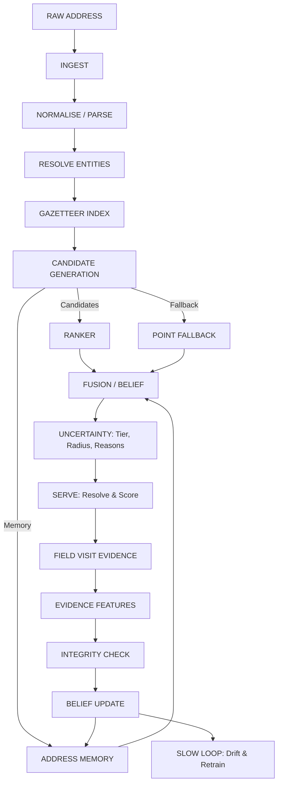

# SUTRA — Address Geocoder That Learns from Field Visits



**SUTRA = Semantic Utility for Traceable Resolution of Addresses.**
A per-town address intelligence that learns from field visits — resolving a written address into a coordinate, a granularity, a **measured radius**, a reason, and an append-only memory that is corrected by evidence and never overwritten by opinion.

## 🚀 Live Demo
Access the live version of the SUTRA platform here:
👉 **[SUTRA Web Application](https://sutra-geospatial-address-intelligence.vercel.app/)**

---

## 📸 Key Features & Interfaces

### The Resolver

The core interface where SUTRA ranks candidates based on official arms, memory, and text evidence, allowing the operator to verify or refuse the resolution based on confidence.

### Field Evidence & Audit

Field visits are treated as evidence, not truth. Every signal produces a weight and a reason code, meaning a single bad actor cannot poison the memory.

---

## 🧠 Model Training & Analytics
We have included the complete model training workflow in our **Jupyter Notebook (`.ipynb`)**. This notebook contains:
- Exploratory Data Analysis (EDA) of the official dataset.
- Feature engineering, candidate ranking logic, and geographical fallback strategies.
- The training loops and inference mechanics behind the SUTRA engine.

*(Note: Data insights and distribution plots are visually explored and saved within the notebook and the `data/derived/eda_charts/` folder)*

---

## 🏗️ Master Architecture Workflow



### The Three Findings That Shaped the Design

1. **Field visits are evidence, not truth.** Failure check-ins sit a median 1,603 m from surveyed truth at a 1.3-minute dwell. Negative evidence raises suspicion but never moves a coordinate automatically.
2. **Integrity is not just GPS.** Agents often reuse photo hashes despite pristine GPS coordinates. Integrity must be cross-signal: *weight, don't accuse*.
3. **Candidate arms alone are worth ~19%.** The oracle over current arms is 306 m median vs the vendor's 376 m. The real value is in memory and evidence — not just a larger language model.

---

## 🗺️ Repository Structure
- `battle_model/` — The interactive Vite React Frontend.
- `sutra/` — The Python intelligence engine and ranking APIs.
- `data/` — Official dataset, derived indexes, and offline SQLite memory store.
- `tools/` — Diagnostics, build scripts, and data preprocessing.
- `research/` & `.ipynb` — Model training, EDA, and architectural proofs.
- `screenshots/` — Visuals of the web application.

## ⚙️ Running Locally
```bash
# Start the Python Backend Service
python3 tools/serve_runtime.py --port 8000

# Start the Frontend
cd battle_model
npm install
npm run dev
```

## The Rules This Package Holds Itself To
1. Never present private augmentation as official data; never mix the two domains silently.
2. Never erase provenance; every coordinate names its evidence and its licence.
3. A mediocre honest number beats a fake impressive one — every figure carries its stratum, its n and its interval.
4. Never trust field GPS, a vendor geocoder, an outcome field or a retrain by default.
5. Weight, don't accuse; widen, don't invent; refuse rather than fabricate.
